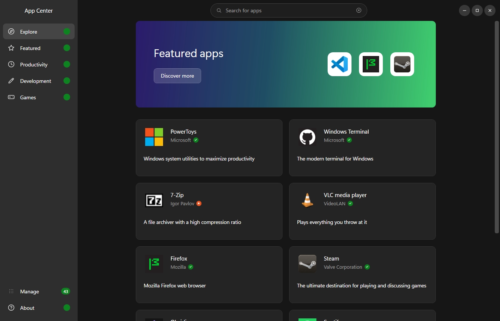

# App Center

Ubuntu's App Center, rebuilt for Windows on top of **winget**. WPF on .NET 10,
and one external package — SharpVectors, to draw the SVG icons WPF cannot.

Free software under the [GPL-3.0](LICENSE), the same licence Canonical give
[Ubuntu's App Center](https://github.com/ubuntu/app-center) — see
[Licence and origins](#licence-and-origins).



## Running it

```
dotnet run --project AppCenter.csproj
```

Or build once and launch the exe:

```
dotnet build -c Release
bin\Release\net10.0-windows\AppCenter.exe
```

Requires the Windows Package Manager (`winget`). It ships with App Installer on
Windows 11; if `winget --version` fails, install App Installer from the
Microsoft Store. The About page reports whether it was found.

## Releasing

```
deploy.bat            builds the version in AppCenter.csproj
deploy.bat 1.1.0      builds that version instead
```

Everything lands in `releases\`:

| | |
| --- | --- |
| `AppCenter-<v>-Setup.exe` | Inno Setup installer, per-user, no UAC |
| `AppCenter-<v>-Setup.exe.sha256` | its digest, for copies of App Center updating themselves from GitHub |
| `AppCenter-<v>-portable.zip` | the publish folder, unpacked and run anywhere |
| `winget\<v>\*.yaml` | the three manifests, hash and version already filled in |

The build is framework-dependent, so the installer looks for the .NET 10 Desktop
Runtime and downloads it from `aka.ms` if it is missing — that is the one case
where a UAC prompt appears, since the runtime installs machine-wide. Everything
else goes into `%LOCALAPPDATA%\Programs\AppCenter`.

`deploy.bat` installs Inno Setup itself (via winget, naturally) the first time it
runs. Version, publisher, licence and project URL come from the config block at
the top of the script and from `<Version>` in `AppCenter.csproj`.

To ship a version: run `deploy.bat`, attach the setup exe, its `.sha256` and the
portable zip to a release tagged `v<version>` under that same URL, then open a
PR on [microsoft/winget-pkgs](https://github.com/microsoft/winget-pkgs) with the
`releases\winget\<v>` folder dropped into `manifests\a\<Publisher>\AppCenter\<v>`.
`winget validate --manifest releases\winget\<v>` checks them before you do.

### Updating App Center from GitHub

The winget PR takes weeks to be merged; the GitHub release is live the moment it
is published. So App Center offers its own newer releases from GitHub, ahead of
winget: on launch (one request to `api.github.com`, switchable off in About)
it reads the latest release, and when that is newer than the running build,
About says so and Manage shows it above the winget updates. Pressing Update
downloads `AppCenter-<v>-Setup.exe` from the release, checks it against the
`.sha256` published beside it, runs it silently with `/RELAUNCH=1`, and exits so
the installer can replace its files; the installer starts the new version when
it is done. It is the same installer winget will offer later, so winget sees a
version at least as new as its manifest and has nothing to redo.

A portable copy (no `unins000.exe` beside the exe) is offered the release page
instead: there is no installer to run over it. GitHub is only ever asked when a
winget update of the same version is not already on offer, so the two routes do
not show the same release twice.

## What it does

| Page | Backed by |
| --- | --- |
| Explore | `catalog.json` — curated banner + picks, categories pinned at the foot |
| Featured / Productivity / Development | `catalog.json` sections, with sorting |
| Games | Curated carousel + Top Rated grid |
| Search | Live `winget search`, enriched with `winget show` |
| App detail | `winget show` + `winget list` for install state; screenshots from the catalogue or the Store |
| Manage | Live `winget upgrade` and `winget list` |

Install, update and uninstall run **real winget commands against this machine**.
Every one of them goes through a confirmation dialog first, and Windows itself
raises the UAC prompt when an installer needs elevation. Nothing is executed
without an explicit click.

`winget upgrade` and `winget list` are read once, shared, and re-read after
every operation (`Services/MachineState.cs`). That one read drives the update
count on the sidebar, the Manage page, and the *Installed* / *Update* chip on
every card, so browsing shows what is already on the machine. An app's own page
asks `winget list --id` itself, and offers Install, Update or Uninstall from
what comes back.

### Manage

`winget list` prints one row per install, which on Windows means eight rows of
Visual C++ redistributables and one per .NET SDK. Manage folds those into
families — one row each, opening to list the installs underneath, every one
with its own Uninstall. A family is decided from the id with its trailing
version, architecture and channel segments removed (`Microsoft.VCRedist.2010.x64`
and `Microsoft.VCRedist.2015+.x86` are both `Microsoft.VCRedist`), or, for the
`ARP\…` and `MSIX\…` handles winget makes up for installs it could not match,
from the name. The family's name is the words its members share
("Microsoft Visual C++ Redistributable"); each member is named by what its own
name adds ("2013 (x64)"). There is no list of known families anywhere — see
`Services/PackageFamilies.cs`.

The filter box reaches both lists; the system-package switch only the installed
one. "Update all" always means every update, whatever the filter is showing, and
the confirmation names them.

### Keyboard

| | |
| --- | --- |
| `Ctrl+F`, `Ctrl+K` | search |
| `Esc`, `Backspace`, `Alt+←`, mouse back button | back from an app's page, a category or a search |
| `Tab`, `Enter`, `Space` | every card, row and button is reachable; keyboard focus draws a ring |

## Layout

```
AppCenter.csproj          net10.0-windows, UseWPF, one NuGet dependency (SharpVectors)
catalog.json              the curated catalogue (edit this to change the pages)
app.manifest              per-monitor v2 DPI awareness
AppCenter.ico             the app icon, 16-256 (see tools/make_icon.py)
LICENSE                   GPL-3.0; ships next to the exe, About links to it
THIRD-PARTY-NOTICES.txt   SharpVectors' BSD-3-Clause notice; ships next to the exe too
deploy.bat                publish + installer + winget manifests -> releases/

installer/
  AppCenter.iss           Inno Setup script, incl. the .NET runtime bootstrap
  winget/template.*.yaml  manifest templates deploy.bat fills in

Themes/
  Palette.xaml            Yaru dark colours, fonts, banner gradient
  Icons.xaml              24x24 stroke geometries for every icon
  Controls.xaml           nav items, buttons, search box, combo box, switch
  Templates.xaml          app card + Manage row templates

Models/AppPackage.cs      one package; notifies so late-arriving data lands
Models/InstalledGroup.cs  one Manage row: a package, or a family of installs
Services/
  WingetService.cs        async wrapper + fixed-width table parser
  MachineState.cs         the one shared read of what winget lists as installed
  AppInfo.cs              this build's version, repository and package id
  AppUpdateService.cs     App Center's own releases from GitHub, ahead of winget
  PackageFamilies.cs      folds the installed list into families
  CatalogService.cs       loads catalog.json
  IconService.cs          favicon fetch + disk cache
Controls/
  AppGrid.xaml            the shared two-column card grid
  ConfirmDialog.xaml      dark confirmation prompt
  Nav.cs, Converters.cs   sidebar badge plumbing
Views/                    one file per page, all deriving from PageView:
                          a pinned header over a scrolling body
tools/make_icon.py        redraws the app icon (needs Pillow + numpy)
```

## The app icon


A shopping bag with an install arrow, on the same indigo-to-green ramp the
Explore banner uses, with the Yaru accent orange on the arrow — so the icon and
the app's first screen are visibly the same thing.

It's drawn rather than stored: `python tools/make_icon.py` renders the artwork on
a 1024x1024 grid at 4x supersample and downsamples into all ten sizes (16-256),
writing `AppCenter.ico` and `docs/icon.png`. Colours are the literals from
`Themes/Palette.xaml`, so re-theming the app and re-running the script keeps them
in step. Pillow and numpy are needed for that script only — the app itself
needs nothing beyond the SDK and SharpVectors.

## Icons for catalogue apps

winget carries no icon data, so icons come **from each app's own homepage** —
or, as a last resort, from its Microsoft Store listing — and are cached in
`%LOCALAPPDATA%\AppCenter\icons`. No third-party icon service is contacted.
Resolution runs in this order:

1. an explicit `"icon"` URL in the `catalog.json` entry, if there is one;
2. otherwise the homepage is read and whatever it declares in
   `<link rel="apple-touch-icon">` or `<link rel="icon">` is used, best first —
   apple-touch-icon ahead of favicon, larger ahead of smaller. An SVG is as
   good as a bitmap: WPF cannot decode one, so
   [SharpVectors](https://github.com/ElinamLLC/SharpVectors) draws it into a
   bitmap of the size everything else is brought down to;
3. failing that, the conventional paths at the site root
   (`/apple-touch-icon.png`, `/favicon.ico`, …);
4. and when all of that yields nothing, the logo from the app's Microsoft
   Store listing, if it has one the app can be sure of — see
   [Screenshots on the detail page](#screenshots-on-the-detail-page) for
   what that means and how the listing is reached. Last rather than first
   so that the two hundred apps already served from their homepages never
   cost the Store a query.

The order matters. Guessing at the site root first is what makes
`https://www.mozilla.org` hand back the Mozilla flag instead of Firefox's logo:
the root of a site is the *company*, and the product icon lives on the product's
own page. Reading the page's own declaration gets Chrome, Edge and Firefox right
without pinning anything.

Code hosts — `github.com`, `gitlab.com`, `sourceforge.net`, `codeberg.org` and
friends — are **skipped entirely**, because every project on them shares one set
of page furniture and therefore one icon. Left alone, a `github.com/user/repo`
homepage puts the Octocat on two dozen unrelated cards, each claiming to be
GitHub. A letter tile says more than that. Subdomains are not matched, so
`desktop.github.com` still gets GitHub Desktop's own icon, which is correct.

Anything that yields nothing falls back to a generated letter tile whose colour
is derived from the package id, so it stays stable between runs. After six
consecutive network failures the app stops trying and runs on letter tiles.

To pin an image, add an `"icon"` URL to the `catalog.json` entry — it takes
priority over everything above, and it is the answer for projects that live on a
code host and have no site of their own. Note that entries are per-section, so
an app appearing on several pages needs the field on each of them.

The cache filename carries a version (`<id>.v3.png`). Bump `CacheSuffix` in
`IconService` when the rules change — without that, a fix never reaches anyone
who already ran the app, because the wrong icon is on disk and gets returned
before any of the new logic runs. A miss is remembered too (`<id>.v4.none`,
for a fortnight); its version moves on its own when a change can only turn
misses into hits, so the good icons on disk are kept.

## Screenshots in the Games carousel

A carousel entry with a `"screenshot"` URL shows it behind the title, under a
gradient scrim; one without keeps its generated colour panel, so the strip reads
as a set of distinct slides either way. The two peek panels either side show the
neighbouring slides' images too.

```json
{
  "id": "Xonotic.Xonotic",
  "screenshot": "https://xonotic.org/static/img/carousel_maps.jpg",
  "name": "Xonotic",
  "summary": "A fast open source arena shooter"
}
```

Unlike icons there is no guessing: nothing about a URL says where a project keeps
its screenshots, and an `og:image` is as likely to be a logo as a game. Every one
is picked by hand, from the project's own site, and only the URL is stored — no
images are redistributed with App Center. They are fetched once, decoded down to
960px on the way in (a 1920x1080 press shot costs 8MB of bitmap held at source
size, for a 250px-tall slide) and cached under `%LOCALAPPDATA%\AppCenter\screenshots`.

## Screenshots on the detail page

Under an app's details sit up to three screenshots, from one of two places:

- **the catalogue.** A `"screenshots"` list on the entry — hand-picked URLs
  from the project's own site, shown in the order given, on the same footing
  as the carousel's `"screenshot"`. These win when present.
- **the app's Microsoft Store listing.** Windows has a documented API for
  reading a Store listing, `Windows.Services.Store.StoreContext` — the call an
  app makes to read its own listing, given another app's id — and it comes
  back with the screenshots and logos the publisher submitted. No web page is
  scraped and no undocumented endpoint is called; the Store client on this
  machine sends the same request.

  The listing is only ever asked for by an **exact identity**, never found by
  name: a `"msstore"` id on the catalogue entry, or the family name of an
  installed MSIX package, which `winget list` prints in the id. Matching by
  name is how "Anki" turns into "MemU Anki Flashcard", and no screenshot is
  better than the wrong app's.

  The API answers only for *packaged* listings — ids beginning with `9`,
  such as `9N0DX20HK701`. The Win32 apps the Store also carries (`XP…` ids:
  PowerToys, OBS, Discord, VS Code, Edge) return nothing through it under
  any product kind, so they cannot be reached this way and are not listed.

The Store is reached through hand-written COM interop in
`StoreListingService` rather than the WinRT projection, which would have
meant a Windows SDK target framework and a twenty-megabyte assembly for two
method calls. The interfaces are declared in vtable order from the SDK
headers, and the parameterised ones carry the IIDs the WinRT signature hash
produces. On a Windows without the Store the first call fails and nothing is
asked again.

Screenshots are fetched once, decoded down to 960px and cached under
`%LOCALAPPDATA%\AppCenter\screenshots`, like the carousel's. Clicking one
opens it large over the whole window, the app dimmed behind it, with arrows
to the next and previous, a close button on the picture's corner, and a
click anywhere outside the picture - or Escape - to put it away. The strip's
copy goes up at once and the full-size picture, decoded at 1920 wide, takes
its place as it lands.

## Editing the catalogue

`catalog.json` is copied next to the exe on build. It currently carries 179
distinct apps across the six sections, spanning browsers, office, creative,
audio and video, developer tooling, system utilities, science and CAD, and
games. Each entry needs a real winget package id; `badge` is `"verified"`
(green tick), `"star"` (orange), or omitted. Every id in the file has been
checked to resolve — to confirm one yourself:

```
winget search --id <Package.Id> --exact --source winget
```

An id that does not resolve still renders a card, but installing it fails, so
it is worth running that check before committing a new entry. Sections may
share apps freely; the same id appears on several pages by design.

Two optional fields feed the detail page: `"msstore"`, the app's Store id
when it has a packaged listing (`winget search --source msstore <name>`
prints it; only ids beginning with `9` are any use — see above), and
`"screenshots"`, a list of image URLs from the project's own site. Like
`"icon"`, both are per-section: an app on several pages needs them on each.

## Notes on the winget layer

`winget` has no machine-readable output for `search`/`list`, so `WingetService`
parses the fixed-width table: it finds the dashed separator, reads the header
above it for column offsets, and slices rows at those offsets. That keeps names
containing spaces intact and tolerates columns being reordered or absent
(`Available` and `Match` only appear sometimes). Lookups are by English header
name with a positional fallback.

## Licence and origins

App Center is free software under the [GNU General Public License v3.0](LICENSE).
Use it, read it, change it, pass it on — anything you pass on carries the same
freedoms.

The licence is not an accident of habit. This app owes its whole shape to
[Ubuntu's App Center](https://github.com/ubuntu/app-center): the sidebar, the
banner, the card grid, the split between a curated catalogue and live search.
Canonical publish that under the GPL-3.0, and taking something more permissive
for a reimplementation of their design would be helping yourself to the idea
while giving less back than they did.

No code is shared between the two. Theirs is Dart and Flutter over snapd; this
is C# and WPF over winget, written from the screenshots outwards. **App Center
for Windows is not affiliated with, sponsored by, or endorsed by Canonical
Ltd.** "Ubuntu" and "Canonical" are trademarks of Canonical Ltd, used here only
to say truthfully what this was modelled on.

The Yaru palette in `Themes/Palette.xaml` is Ubuntu's, taken from the
[Yaru theme](https://github.com/ubuntu/yaru) (GPL-3.0 / CC-BY-SA-4.0).

SVG icons are drawn by [SharpVectors](https://github.com/ElinamLLC/SharpVectors),
© Elinam LLC, under the BSD-3-Clause licence. Its notice is in
`THIRD-PARTY-NOTICES.txt`, which ships alongside `LICENSE`.

Distributing a build means passing on the source it was built from — the GPL
asks for that, and `LICENSE` ships inside the installer and the portable zip so
the terms travel with the binary.
